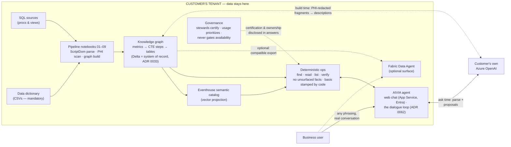

# Architecture — the Sphere

<!-- TIER: BLUEPRINT — generated marker, do not remove.
     Component key: architecture (src/trace_registry.py ARCHITECTURE_COMPONENTS)
     Enforced by tests/test_trace_registry.py hierarchy checks. -->

> **Blueprint tier.** This file satisfies axiom groups **axm:D** (Data)
> · **axm:S** (Specification) · **axm:J** (Judgment) · **axm:R**
> (Residue & Ledger) from [AI_VIA_AXIOMS.md](../AI_VIA_AXIOMS.md), and
> is the architecture home for 16 decisions
> (see [TRACE_MAP.md](TRACE_MAP.md#the-blueprint-tier) for the full
> chain: decision → component → axioms → code → tests).

**One system-model file (ADR 0066, 2026-09-02):** the former
SPHERE.md merged in here — the Sphere (ADR 0057's ratified design
record) is now this document's organizing model, not a separate
destination file. **Every section carries a build status:**

| Chip | Meaning |
|---|---|
| `BUILT` | shipped and tested — TRACE_MAP names the code |
| `PARTIAL` | some legs shipped; the gap is stated |
| `DESIGN` | ratified direction; binds future design, not the build queue |

The formal layer vocabulary is [SPEC.md](SPEC.md) §4 (one name set for
humans, ADRs, and code — ruled 2026-08-19); this file never restates it.

---

## The System at a Glance — `BUILT`

Everything runs inside the customer's tenant. The only service any data
ever reaches is the customer's **own** Azure OpenAI — at build time for
PHI-redacted description generation, at ask time for the conversation
itself. Every factual claim in an answer comes from the deterministic
tool layer over the certified graph; the code-stamped **Basis** line
under every answer discloses exactly what was consulted (ADR 0035).



Three sentences of it: **(1)** A Python library (.whl) parses the
customer's SQL and data dictionary into a layered knowledge graph,
entirely in their lakehouse. **(2)** The AIVIA agent runs the dialogue
loop — show, propose, ask, execute (ADR 0062) — while deterministic
code owns every computation; each answer carries a code-stamped Basis
line, with named steward/developer accountability and refusal instead
of guessing. **(3)** The only service data ever reaches is the
customer's own Azure OpenAI — build time gated by deterministic PHI
redaction, ask time under the user's own identity — we never ship or
hold a key. (A Fabric Data Agent can optionally be pointed at the same
certified tables; it is not the product's answer path, ADR 0060 §3.)

Parsing is one law, total: **every dialect gets its own native parser
(ScriptDom for T-SQL), never text-based extraction** — sqlglot/sqlparse
are deleted repo-wide and CI-banned (`spec:G2`,
`tests/test_native_parser_law.py`). Structure comes off the ScriptDom
AST directly; the node is held and passed down, never re-parsed from
text. Full rationale and the history of failed alternatives:
[ADR 0001](../decisions/0001-native-parsers-per-dialect.md).

## The four shells (inside → out) — `PARTIAL`

*(ADR 0057; shells 1–3 are built as data, shell 4 is partially built —
decision capture ships (ADR 0056, `src/flywheel.py`), the ownership
economy does not.)*

1. **Foundation — EMR reality.** The customer's schema truth:
   tables, columns, keys, declared join topology, AND the standard
   vocabularies (ICD-10, LOINC, RxNorm). SOVEREIGN: independent of
   what any SQL happens to use. Built at BYOT ingestion from the
   customer's proprietary dictionaries — the deliverable is the
   ingestion tooling. **Rung-3 composition depends on foundation
   sovereignty**: new questions need join paths no existing SQL ever
   used. Owners: admins/IT (rightfully — this IS their layer).
2. **Org artifacts — organizational reality.** Parsed SQL (steps,
   decision sites) AND PBI reports/semantic models — everything the
   organization built, pointing down into foundation. PARSED TRUTH:
   AIVIA is never the editor; writes here are OBSERVED (ingestion
   diffs — the "3 changed, 0 new" machinery is the write-detection
   surface; ripple latency = sync cadence). Owners: developers.
3. **Canonical — the organization's ontology.** Named business
   concepts as first-class nodes, **born bottom-up from extraction**,
   with many-to-many CLAIM edges onto org artifacts. NOT
   descriptions (those are 1:1 attributes on org nodes); the layer
   exists because meaning has identity, cardinality, and lifecycle
   apart from implementation (one concept, N implementations; the
   concept survives reimplementation; governance objects attach
   here). **A term is GOVERNED when its claims are
   consistent-or-dispositioned** — the red-flag sweep is this
   layer's health meter; KPI: unlabeled divergences → 0.
4. **The human shell.** Users as nodes; decisions (ADR 0056) as
   typed asserted edges; ownership as SCOPED edges (administers /
   develops / stewards / owns-citizen-copy). The shell ADDS to inner
   shells (testimony, forks, rung-3 drafts, canonical amendments);
   it never rewrites parsed fact (P2).

## Radial dynamics — the two pillars are two directions — `PARTIAL`

*(Outward is built; inward is built through the run layer's slice 1,
ADR 0061 — rung-3 composition is not.)*

- **Governance = outward:** extract from SQL → translate → attach to
  concepts → searchable. (Basic tier.)
- **Self-service = inward:** concept → implementation → foundation →
  EXECUTE → data. (Pro tier; the execution leg shipped read-only,
  gated — ADR 0061.) Three rungs as provenance grades (ADR 0058).

### The flywheel — every question makes the system better — `BUILT`

*(Folded in from the retired USER_FLOW.md, ADR 0071 — the ~15 lines
that were law; the rest was duplication or story.)*

- **Refusal is intake** (ADR 0005): "I don't have a certified
  definition for that yet" logs the demand; certification turns the
  next ask into a grounded answer. There are no wasted questions.
- **Weights are derived, never stored** (`spec:L2`): confirms, runs,
  prunes and escalations are append-only events (ADR 0023/0056);
  every usage number is recomputed from the ledger.
- **The escalation door stands at every round** (`spec:R4`): an
  exhausted loop becomes a captured-demand handoff — the developer
  arrives knowing what the user wanted and what the graph lacks.
- **Weight patterns are promotion signals:** a metric asked
  constantly is a dashboard candidate; a declining one is a staleness
  flag; cross-department demand is a steward-alignment call.

## Data flow — `BUILT`

```
SQL Sources ──► ScriptDom parse ──► ParsedSQL (+ decision trees)
                                  │
Data Dictionary ──────────────────┤
                                  ▼
                           GraphBuilder
                                  │
                    ┌─────────────┼──────────────┐
                    ▼             ▼              ▼
             Delta Tables   MetadataGenerator  Eventhouse
            (the RECORD,          │            semantic catalog
             ADR 0033)       ┌────┴────┐       (a PROJECTION)
                    │        ▼         ▼
                    │     Purview   Collibra
                    │     adapter   adapter
                    │        └────┬────┘
                    │             ▼
                    │      Write-Back Queue (ADR 0063)
                    │      proposals → human approval → land
                    ▼
             the dialogue loop (ADR 0062)
             show → propose → ask → execute
                    │
                    ▼
             stamped map on glass
             (+ optional run of the CONFIRMED
              step SQL, read-only — ADR 0061)
```

Every non-Delta store above is a **projection** and is rebuilt from the
record each run (`spec:D3`); none is a second source of truth.

## The nervous system (change propagation) — `DESIGN`

ONE RULE: for every changed node, walk one hop; notify along
ownership edges; payload = typed delta (breaking vs additive) with
error-contract receipts (delta + node + drill + suggested action).
- Native writes (canonical, citizen, decisions) ripple instantly.
- Observed writes (foundation, org) ripple at ingestion diff.
- **Meaning-leads-code:** a steward's canonical amendment (e.g., the
  81st ICD code) opens a typed `pending_implementation` gap;
  developers are notified with blast radius; **the gap closes by
  PARSING, never by claiming** — assertion opens, evidence closes.
- Inboxes are usage-ranked (0056 decision weights) and digested —
  governance interrupts in usefulness order.

## The ownership economy — `DESIGN`

- **Unbundle "owner":** SUBSCRIBER (unbounded, automatic — testimony
  edges ARE the subscription list: your past decisions are your
  subscriptions) · ACCOUNTABLE OWNER (one-or-few; must act) ·
  AUTHORITY (scoped certification). "Forty owners is zero owners."
- **Stewards follow uses:** stewardship is accountability for a
  USE (regulatory submission, board metric, contract measure),
  never authority over a MEANING. Meanings stay plural; uses have
  owners; a term with no single-truth use needs NO steward.
- **Staffing = harvest, not campaign:** the seat is OFFERED at the
  moment of demonstrated care (first strong testifier:
  "accept stewardship?" — opt-in at peak willingness). Two doors:
  earned (default, disclosed as earned, contestable) and appointed
  (org override; use-anchored stewards are structural — the
  submission owner). Rung-3 drafts: creator owns immediately;
  promotion to shared truth is where accountability formalizes.
- **Ownership lifecycle (conservation over accountability):**
  unowned+unused (retirement candidate) ⊎ unowned+used (harvest
  queue) ⊎ provisional (earned) ⊎ stewarded. New flag classes:
  orphaned ownership; retirement candidates; reference-vocabulary
  violations (invalid codes — machine-detectable case-a wrongness).

## The wrongness taxonomy (typed deny) — `PARTIAL`

*(ADR 0056 amended by 0057; decision capture is built
(`src/flywheel.py`), the per-type routing matures with the console.)*

Wrongness is always relative to a GROUND; each ground has a
structurally rightful owner:

| deny type | ground | routes to |
|---|---|---|
| defect | code vs its own intent (typo/invalid vocab) | developer (bug report; vocab flags pre-file most) |
| mismatch | valid definition, not MY definition | back to denier as a FORK OFFER |
| noncompliance | definition vs external mandate | the use-owner |

## Contracts in the graph (the split) — `PARTIAL`

*(The static contracts and their code checks are built; the projection
of contracts INTO the graph as read-only nodes is direction. The admin
graph, ADR 0048, is the built piece of it.)*

- **Static system contracts** (schemas, consumers, op registry,
  guards): CODE-AUTHORITATIVE (intentions decay; only enforcement
  survives), PROJECTED into the graph as generated read-only nodes;
  CI asserts projection == code (conservation). The agent answers
  questions about the rules by traversal; the rules are not
  editable as data.
- **Dynamic governance contracts** (ownership edges, scoped
  authority, subscriptions): GRAPH-NATIVE by necessity
  (per-customer, runtime-born via decisions); enforced by code that
  READS them; asserted-layer disciplines apply.
- **Guard:** the graph may describe every rule; only the most
  protected writes may change a rule; the rules about changing
  rules never leave code.
- **Self-ingestion (direction):** AIVIA's own pipeline is
  SQL-and-Python over tables — ingest it; declared consumers become
  verifiable by our own lineage machinery. The product governs
  itself with itself.

## The presentation doctrine — `PARTIAL`

*(Sunny's reframe, 2026-08-25; the compare cards, diff lines and the
0062 iteration card ship it at answer time; the differentiation-queue
estate surface lands with the console, ADR 0063.)*

AIVIA delivers THE MAP, NOT THE VERDICT. Answer-time surface:
matches-with-differences (every matching definition, diffed by
path/persona/grain/codeset — the variant map IS the answer; choose
follows). Estate surface: the DIFFERENTIATION QUEUE (the flag
objects, reframed — addressable nouns the disposition acts attach
to), usage-ranked, never a violations list. Alarm semantics
reserved for the defect class alone (invalid vocab, typos, mandate
violations — the one place wrongness exists). Detection machinery
identical under both framings; internal table names unchanged.

## Clusters are nodes — `BUILT`

*(Sunny's ruling, 2026-08-25; shipped — flags land as `cluster:`
nodes in the sweep, ADR 0054.)*

Shapes live IN the graph as REIFIED CLUSTER NODES with membership
edges — never pairwise edges (N-member clusters explode O(N²) and
give dispositions no home), never labels alone (no addressable
noun). Structure: name_cluster node → logic_group nodes (the
content-hash partition — identical in shape to the compare verdict)
→ member_of edges. Dispositions, certifications, and 0056 testimony
attach to cluster/group nodes as asserted edges; the governance
stamps become real one-hop edges; census/retrieve traverse instead
of searching a side table. Detection stays DETERMINISTIC
(fold-name, content-hash, token containment, materialized closures
— never stochastic clustering; M4/E2 hold). Cluster nodes get 0052
registry rows like every payload.

## The formal guarantee (three legs) — `PARTIAL`

1. **Reachability** (ADR 0052, `BUILT`): every element reachable
   by a named op ⊎ excluded-with-reason.
2. **Round-trip translatability** — promised here as a "NEW axiom"
   on 2026-08-25 and **delivered as SPEC Group T** (ADR 0065,
   `spec:T0`–`T3`): SQL → meaning findable; meaning → SQL findable;
   the meaning → data leg gated with the run layer.
3. **Answer-or-named-gap totality** (`PARTIAL`): every question
   answers with evidence or refuses with the NAMED reason; never
   silent, never invented. Conditional on the op algebra's
   expressiveness — out-of-algebra questions fail LOUD at plan time
   (the proven boundary; proof where proof exists, disclosure where
   it doesn't).

## The limits of graph language — doctrine

*(Sunny's challenge, 2026-08-26 — the folder's standing theorem.)*

Every state, structure, and rule is graph-EXPRESSIBLE (reified per
the contracts split), and every compliance check reduces to three
graph computations: forbidden patterns (most laws — single-writer,
ownership, even the Echo Law as "echo node with no mechanism edge"),
conservation equations (the completeness family), and fixpoint
derivations (connectivity/closures — provably beyond single
traversals, hence materialized per ADR 0018). Three things escape,
each governed by an existing law: (1) ENFORCEMENT cannot live inside
the structure it governs — the graph finds violations, code refuses
commits ("the rules about changing rules never leave code");
(2) the STOCHASTIC TRANSLATOR escapes all specification — gated by
code, witnessed per instance, its evidence graphed but never itself;
(3) UNDECIDABLE SEMANTICS (D2) — pointed at and disclosed, never
decided. The theorem: the graph can SAY everything; extended with
derivation and counting it can CHECK everything checkable; it can
ENFORCE nothing alone — code enforces, humans witness. Everything
folds into the graph except the fold's own guarantor.

## The isolation law (three legs) — `BUILT`

Demo/shape material is isolated from the realism estate at EVERY
stratum it touches, or it is not isolated at all:

1. **Store leg** (ruled 2026-08-24): its own lakehouse — same table
   names, different store; collision is structurally impossible.
2. **Catalog leg**: its own KQL database and semantic_search
   surface; the ask switches by config, never by filtering.
3. **Source leg** (field find 2026-08-27 — the seed collided with
   the sepsis corpus in the SHARED demo SQL database; Msg 207 at
   compile held it): its own source database (aivia_shapes_src),
   and every seed script opens with an ISOLATION GUARD that refuses
   a database holding foreign tables — fail loud before the first
   DROP. A leg nobody thought to isolate is where the collision
   arrives.

## Module map — `BUILT`

> **Orientation, not inventory.** This map shows the ingest→graph spine
> only. The AUTHORITATIVE, generated module list is
> [TRACE_MAP.md](TRACE_MAP.md) (every module cited by the decision that
> owns it — an uncited module is a CI finding, per ADR 0048's totality
> check). Subsystems deliberately not drawn below, each with its own
> lineage in TRACE_MAP: `orchestrator/` (the turn engine, ops, the
> parse plan), `tree/` (the round-trip contract, ADR 0044), `webapp/`
> (the dialogue loop, ADR 0062), `discovery/`, `shapes/`, `mquery/`,
> `marketplace/`, plus the seven peer registries and the run layer
> (`run_layer.py`, ADR 0061), X-Ray (`xray.py`) and console
> (`console.py`) of the ADR 0063 tiers.

```
src/
├── config.py              # Load org_config.yaml (pydantic models, gitignored file)
├── models.py              # GraphNode/GraphEdge, NodeLayer/EdgeType/CertificationStatus enums
├── schemas.py             # DATA CONTRACTS: TABLE_REGISTRY — shape, semantics,
│                          #   ownership, consumers, invariants for every Delta table
├── invariants.py          # Generic invariant checker (unique/allowed_values/reference)
├── dictionary.py          # Data dictionary (case-insensitive matching, ADR 0016)
├── pipeline.py            # Local end-to-end graph build (dev/demo entry point)
├── steps/                 # PURE PIPELINE STEPS — notebooks are thin callers
│   ├── parse.py               # sources -> parse results/errors/successes
│   ├── build_graph.py         # parse results + dictionary -> nodes/edges
│   ├── metric_logic.py        # graph -> agent's flattened metric_logic
│   ├── export.py              # graph -> typed LPG tables
│   ├── readiness.py           # deployment gate decision (pure)
│   └── gates.py               # Registry-driven postcondition gate per notebook
├── parser/
│   ├── sql_parser.py          # SQL -> ParsedSQL (CTEs, table/column refs)
│   ├── scriptdom_fabric.py    # ScriptDom via pythonnet in Fabric (the parser)
│   ├── scriptdom_loader.py    # ScriptDom assembly load (.NET via pythonnet)
│   ├── identity.py            # metric_id extraction, case folding, dup detection
│   └── error_classifier.py    # Parse errors -> user-facing categories/fixes
├── graph/
│   ├── builder.py             # Build the layered graph (folded node IDs)
│   ├── traversal.py           # Metric subgraph traversal (lineage semantics)
│   ├── serialization.py       # Rows <-> objects; parse->build payload contract
│   ├── metric_logic.py        # Flatten graph -> metric_logic rows
│   ├── export.py              # Split graph -> typed LPG tables
│   ├── backend.py             # GraphBackend protocol (Delta vs Fabric Graph)
│   ├── delta_backend.py       # Delta implementation
│   ├── fabric_graph_backend.py# Fabric Graph implementation (rematch candidate)
│   └── gql_client.py          # GQL query client for Fabric Graph
├── governance/
│   ├── validation.py          # Per-metric six-step pipeline validation
│   ├── error_log.py           # Cross-run error log with regression detection
│   ├── steward.py             # Steward assignment management
│   └── installation_errors.py # Error KB seeds (one home; powers /troubleshoot)
├── extractor/                 # Live SQL Server extraction
│   ├── connection.py          # SQL Server connection (Fabric JDBC / local pyodbc)
│   ├── discovery.py           # Discover views/procs from sys catalogs
│   ├── extractor.py           # Orchestrator: discover -> diff -> sql_sources
│   ├── tracker.py             # Change detection via SHA-256 hashing
│   └── devops_tmdl.py         # TMDL lineage from DevOps repos (PBI)
└── adapters/
    ├── base.py                # CatalogAdapter protocol + MetadataRecord models
    ├── metadata_generator.py  # Graph nodes -> catalog-agnostic MetadataRecords
    ├── publisher.py           # Orchestrate publishing to multiple catalogs
    ├── purview.py             # Microsoft Purview Data Map adapter
    ├── collibra.py            # Collibra REST API adapter
    ├── collibra_lineage.py    # Collibra lineage retrieval
    ├── collibra_lineage_match.py # Fuzzy-match metrics to Collibra assets
    ├── fabric_agent.py        # Fabric Data Agent client (MCP protocol)
    └── fabric_pbi.py          # Power BI report description updater
```

Deployment (BYOT .whl, tiers, Azure footprint):
[REFERENCE_ARCHITECTURE.md](REFERENCE_ARCHITECTURE.md).

---

*Superseded content removed by ADR 0066 (git keeps the lineage): the
July three-layer diagram (SPEC §4 is the layer vocabulary), the
two-path question-flow section (ADR 0062 is the record), the
native-parsers deep-dive (ADR 0001 is the rationale home), the
design-decisions table (decisions/README.md is the index).*
