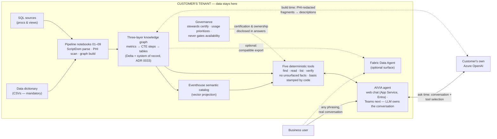

# Architecture

## The System at a Glance

Everything runs inside the customer's tenant. The only service any data
ever reaches is the customer's **own** Azure OpenAI — at build time for
PHI-redacted description generation, at ask time for the conversation
itself. Every factual claim in an answer comes from the deterministic
tool layer over the certified graph; the code-stamped **Basis** line
under every answer discloses exactly what was consulted (ADR 0035).



Three sentences of it: **(1)** A Python library (.whl) parses the
customer's SQL and data dictionary into a three-layer knowledge graph,
entirely in their lakehouse. **(2)** The AIVIA agent holds a real
conversation while five deterministic tools own every computation —
each answer carries a code-stamped Basis line naming exactly what was
searched, read, and verified, with named steward/developer
accountability and refusal instead of guessing. **(3)** The only
service data ever reaches is the customer's own Azure OpenAI — build
time gated by deterministic PHI redaction, ask time under the user's
own identity — we never ship or hold a key. (A Fabric Data Agent can
optionally be pointed at the same certified tables; it is not part of
the product's answer path.)

## Three-Layer Graph Model

This system builds a **graph of business logic** from SQL, stored in Delta tables, and uses it to ground a Fabric Data Agent so it can answer metric questions with 100% traceable accuracy.

```
┌─────────────────────────────────┐
│  CANONICAL LAYER                │
│  Business metrics (e.g. ER_LOS) │
│  Owners: steward + developer    │
│  Usage weight (query count)     │
└──────────────┬──────────────────┘
               │ canonical_to_transform
┌──────────────▼──────────────────┐
│  TRANSFORMATION LAYER           │
│  CTE pipeline steps             │
│  Stores: sql_fragments (NOT     │
│  full SQL — LLM assembles)      │
│  Edges: transform_to_transform  │
└──────────────┬──────────────────┘
               │ transform_to_technical
┌──────────────▼──────────────────┐
│  TECHNICAL LAYER                │
│  Physical tables + columns      │
│  Enriched with data dictionary  │
│  descriptions at build time     │
├─────────────────────────────────┤
│  ◄── DIMENSION NODES            │
│  Branch sideways for dynamic    │
│  parameter filtering            │
└─────────────────────────────────┘
```

## User Question Flow

When a user asks the Data Agent a question, two things happen in parallel:

```
User asks: "What is the average ER length of stay?"
                    │
        ┌───────────┴───────────┐
        ▼                       ▼
  KNOWLEDGE GRAPH           PURVIEW
  (ground truth)         (report discovery)
        │                       │
        │ Traverse certified    │ Search for existing
        │ path, assemble        │ reports/dashboards
        │ answer from           │ that cover this
        │ sql_fragments         │ metric
        │                       │
        ▼                       ▼
  ┌─────────────┐       ┌──────────────────┐
  │ ANSWER:     │       │ "BTW, the Monthly│
  │ 4.2 hours   │       │ OR Dashboard     │
  │ (certified) │       │ already tracks   │
  │             │       │ this — here's    │
  │ Source:     │       │ the link"        │
  │ encounter + │       │                  │
  │ department  │       │ OR:              │
  │ tables      │       │ "No existing     │
  │             │       │ report found"    │
  └─────────────┘       └──────────────────┘
        │
        ▼
  Usage weight incremented
  on the metric node
```

### Two Paths for Every Question

**Path A: Known Logic (certified path exists)**
1. Agent finds metric in the knowledge graph
2. Assembles answer from sql_fragments via the transformation chain
3. Checks Purview for existing reports covering this metric
4. Returns answer + report link (if found) + lineage
5. Increments usage weight on the canonical node

**Path B: Unknown Logic (no certified path)**
1. Agent says "I don't have a certified definition for that yet"
2. Triggers notification to data steward
3. Checks Purview for existing reports (may still find something useful)
4. Steward reviews, certifies -> new node added to graph
5. Next time anyone asks, Path A handles it

### Why Knowledge Graph for Answers, Purview for Discovery

The knowledge graph and Purview serve different roles:

| | Knowledge Graph | Purview |
|---|---|---|
| **Role** | The brain — answers questions | The librarian — finds existing reports |
| **Contains** | sql_fragments, transformation chains, dimension filters | Report/dataset metadata, lineage, classifications |
| **Strength** | Composable, executable logic | Catalog of everything in the org |
| **Weakness** | Only knows certified metrics | Metadata only — can't compute answers |

Purview is a catalog, not a query engine. It stores metadata *about* data but not the calculation logic, sql_fragments, or dimensional filtering rules the agent needs to assemble a query. The knowledge graph stores all of that.

But Purview excels at discovery: "Does a report already exist that answers this?" This reduces redundant report requests and helps users find dashboards they didn't know about.

## Core Design Principle: Native Parsers for Each Dialect

**Use the dialect's own parser. Never try to build a universal text-based SQL extractor.**
(Recorded as [ADR 0001](../decisions/0001-native-parsers-per-dialect.md).)

Enterprise SQL stored procedures are not just SQL — they are programs written in a specific procedural language (T-SQL, PL/SQL, Snowflake SQL) with SQL queries embedded inside. Generic SQL parsers (sqlglot, sqlparse) understand the SQL parts but choke on the procedural parts. Text-based approaches (regex, LLM extraction) are inherently unreliable because developers write code in unpredictable ways.

The solution: delegate parsing to the tool that was built specifically for that dialect.

| Dialect | Native Parser | How We Use It |
|---|---|---|
| **T-SQL** (SQL Server, Fabric) | Microsoft ScriptDom | .NET DLL loaded via pythonnet in Fabric notebooks |
| **PL/SQL** (Oracle) | ANTLR4 PL/SQL grammar | Python ANTLR runtime (future) |
| **Snowflake SQL** | ANTLR4 Snowflake grammar | Python ANTLR runtime (future) |

### How it works

```
Raw Stored Procedure (T-SQL, PL/SQL, etc.)
    │
    ▼
Native dialect parser (ScriptDom, ANTLR, etc.)
    │ Understands EVERYTHING: DECLARE, IF, WHILE, SELECT, temp tables
    │ Produces a complete, typed AST
    ▼
Walk AST: extract only SelectStatement / InsertStatement nodes
    │ Verbatim SQL — zero text corruption
    ▼
sqlglot: structural extraction (CTEs, tables, columns, joins)
    │ Works perfectly on clean, isolated SQL statements
    ▼
Graph builder: wire nodes and edges
```

### Why this works

- **Native parsers are 100% accurate** — they use the same grammar as the database engine itself
- **No text manipulation** — extracted SQL is the original text, character for character
- **No regex maintenance** — no patterns to add when new SQL constructs appear
- **No LLM dependency** — deterministic, instant, free
- **Scales to any dialect** — add a new grammar, get a new parser

### What we tried before (and why it failed)

| Approach | Result | Why it failed |
|---|---|---|
| Regex stripping | 64-87% | Can't predict all ways developers write code |
| sqlparse splitting | 32-87% | Doesn't understand T-SQL procedural grammar |
| LLM extraction | 79% | Non-deterministic, slow, garbles output |
| Token walking | 56% | Can't split statements without semicolons |
| ANTLR Python wrapper | Works but 7min/proc | antlr-tsql package not production-viable |
| **ScriptDom** | **100%** | **Microsoft's own T-SQL parser — the same one powering SSMS** |

---

## Design Decisions

Full rationale lives in [docs/decisions/](../decisions/README.md) — one ADR per
decision. Summary:

| Decision | Summary | ADR |
|---|---|---|
| Native parsers per dialect | ScriptDom for T-SQL; never text-based extraction | [0001](../decisions/0001-native-parsers-per-dialect.md) |
| Delta tables over Neo4j | Stay in the Fabric ecosystem; no external graph DB | [0002](../decisions/0002-delta-tables-over-graph-db.md) |
| sql_fragments, not full SQL | Composable, auditable per-step logic; LLM assembles at query time | [0003](../decisions/0003-sql-fragments-not-full-sql.md) |
| Two-stage HITL certification | Developer certifies technical, steward certifies business correctness | [0004](../decisions/0004-two-stage-hitl-certification.md) |
| "I don't know" over guessing | Refusal is the guardrail and triggers the certification flywheel | [0005](../decisions/0005-refuse-over-guess.md) |
| Graph answers, Purview discovers | Purview can't compute answers; it surfaces existing reports | [0006](../decisions/0006-graph-answers-purview-discovery.md) |
| BYOT .whl deployment | All processing in the customer's tenant; no AIVIA infrastructure | [0007](../decisions/0007-byot-library-deployment.md) |
| `metric_logic` grounding, mandatory dictionary | Flat pre-joined table for the agent; dictionary gates deployment | [0014](../decisions/0014-metric-logic-grounding-mandatory-dictionary.md) |

## Module Map

```
src/
├── config.py              # Load org_config.yaml (pydantic models, gitignored file)
├── models.py              # GraphNode/GraphEdge, NodeLayer/EdgeType/CertificationStatus enums
├── schemas.py             # DATA CONTRACTS: TABLE_REGISTRY — shape, semantics,
│                          #   ownership, consumers, invariants for every Delta table
├── invariants.py          # Generic invariant checker (unique/allowed_values/reference)
├── dictionary.py          # Data dictionary (case-insensitive matching, ADR 0016)
├── pipeline.py            # Local end-to-end graph build (dev/demo entry point)
├── steps/                 # PURE PIPELINE STEPS — notebooks are thin callers
│   ├── parse.py               # 02: sources -> parse results/errors/successes
│   ├── build_graph.py         # 03: parse results + dictionary -> nodes/edges
│   ├── metric_logic.py        # 04: graph -> agent's flattened metric_logic
│   ├── export.py              # 05: graph -> 9 typed LPG tables
│   ├── readiness.py           # 06: deployment gate decision (pure)
│   └── gates.py               # Registry-driven postcondition gate per notebook
├── parser/
│   ├── sql_parser.py          # SQL -> ParsedSQL (CTEs, table/column refs; sqlglot)
│   ├── scriptdom_fabric.py    # ScriptDom via pythonnet in Fabric (primary parser)
│   ├── scriptdom_extractor.py # ScriptDom client wrapper
│   ├── sql_extractor.py       # sqlparse-based fallback extractor
│   ├── identity.py            # metric_id extraction, case folding, dup detection
│   └── error_classifier.py    # Parse errors -> user-facing categories/fixes
├── graph/
│   ├── builder.py             # Build the three-layer graph (folded node IDs)
│   ├── traversal.py           # Metric subgraph traversal (lineage semantics)
│   ├── serialization.py       # Rows <-> objects; 02->03 payload contract (both halves)
│   ├── metric_logic.py        # Flatten graph -> metric_logic rows
│   ├── export.py              # Split graph -> typed LPG tables
│   ├── backend.py             # GraphBackend protocol (Delta vs Fabric Graph)
│   ├── delta_backend.py       # Delta implementation
│   ├── fabric_graph_backend.py# Fabric Graph implementation (rematch candidate)
│   └── gql_client.py          # GQL query client for Fabric Graph
├── governance/
│   ├── validation.py          # Per-metric six-step pipeline validation
│   ├── error_log.py           # Cross-run error log with regression detection
│   ├── steward.py             # Steward assignment management
│   └── installation_errors.py # Error KB seeds (one home; powers /troubleshoot)
├── extractor/                 # Tier 2 on-prem SQL Server extraction
│   ├── connection.py          # SQL Server connection (Fabric JDBC / local pyodbc)
│   ├── discovery.py           # Discover views/procs from sys catalogs
│   ├── extractor.py           # Orchestrator: discover -> diff -> sql_sources
│   ├── tracker.py             # Change detection via SHA-256 hashing
│   └── devops_tmdl.py         # TMDL lineage from DevOps repos (PBI)
└── adapters/
    ├── base.py                # CatalogAdapter protocol + MetadataRecord models
    ├── metadata_generator.py  # Graph nodes -> catalog-agnostic MetadataRecords
    ├── publisher.py           # Orchestrate publishing to multiple catalogs
    ├── purview.py             # Microsoft Purview Data Map adapter
    ├── collibra.py            # Collibra REST API adapter
    ├── collibra_lineage.py    # Collibra lineage retrieval
    ├── collibra_lineage_match.py # Fuzzy-match metrics to Collibra assets
    ├── fabric_agent.py        # Fabric Data Agent client (MCP protocol)
    └── fabric_pbi.py          # Power BI report description updater
```

## Data Flow

```
SQL Sources ──► sql_parser ──► ParsedSQL
                                  │
Data Dictionary ──────────────────┤
                                  ▼
                           GraphBuilder
                                  │
                    ┌─────────────┼─────────────┐
                    ▼             ▼              ▼
             Delta Tables   MetadataGenerator   (future: more)
            (nodes + edges)       │
                    │        ┌────┴────┐
                    ▼        ▼         ▼
             GraphTraverser  Purview   Collibra
                    │        Adapter   Adapter
                    ▼
             Fabric Data Agent
              (user questions)
                    │
              ┌─────┴─────┐
              ▼            ▼
        Knowledge     Purview Lookup
        Graph Answer   (existing reports)
```

## Deployment Models

The product is packaged as a **Python library (.whl)** that runs inside the customer's
Microsoft Fabric environment (BYOT — Bring Your Own Tenant).

### Current: Fabric Notebook + Library

```
Customer's Fabric Tenant
├── Lakehouse (their data)
├── Notebook (imports our library)
│   └── pip install sql-query-agent.whl
├── Delta Tables (graph_nodes, graph_edges)
└── Data Agent (grounded in the graph)
```

- Simplest to build and maintain
- Fabric customers already comfortable with Notebooks
- Customer pays for Fabric compute, we charge for the library license

### Future Option: Azure Managed Application

Package as an Azure Managed Application for one-click enterprise deployment:
- Customer deploys from Marketplace into their resource group
- Governed by our deployment template (ARM/Bicep)
- More "productized" than a raw .whl — easier for enterprise procurement
- Consider when customer base grows beyond early adopters
