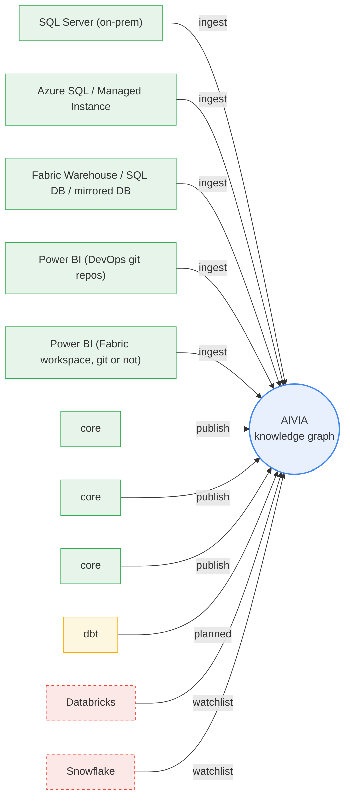

<!-- GENERATED FILE — do not edit.
     Source: INTEGRATION_REGISTRY in src/integration_registry.py
     Regenerate: python scripts/generate_docs.py
     CI fails if this file differs from regeneration. -->

# Integration Map

The tool/connector landscape as data: what AIVIA parses on the way in
(always via each layer's native parser) and what it publishes on the way
out. Supersedes the ROADMAP connector table (2026-08-07) and the
REFERENCE_ARCHITECTURE tier table as source of truth.

| From | To | Artifact parsed | Mechanism | Status | Tier | Direction |
|---|---|---|---|---|---|---|
| SQL Server (on-prem) | core | sys.sql_modules definitions (procs + views) | extractor: onprem_gateway profile (JDBC via On-premises Data Gateway) -> ScriptDom | shipped | Basic | ingest |
| Azure SQL / Managed Instance | core | sys.sql_modules definitions (procs + views) | extractor: azure_direct profile (AAD-token pyodbc) -> ScriptDom | shipped | Basic | ingest |
| Fabric Warehouse / SQL DB / mirrored DB | core | sys.sql_modules definitions (procs + views) | extractor: fabric_native profile (AAD-token pyodbc) -> ScriptDom | shipped | Basic | ingest |
| Power BI (DevOps git repos) | core | TMDL (.SemanticModel: partitions, DAX measures, calc columns) | TMDL parser via devops_git profile (PAT from Key Vault) | shipped | Pro | ingest |
| Power BI (Fabric workspace, git or not) | core | TMDL incl. DirectLake partitions (entityName) | TMDL parser via workspace profile (REST getDefinition, no git needed) or folder profile (git-synced); DirectLake = pattern 5, report->technical edges | shipped | Pro | ingest |
| core | Power BI reports | report descriptions (Fabric REST PATCH) | fabric_pbi adapter, lineage-exact matching (13_publish_pbi) | shipped | Pro | publish |
| core | Collibra | assets + descriptions + glossary terms (REST) | collibra adapter (08_publish_collibra) | shipped | Pro | publish |
| core | Microsoft Purview | assets + descriptions (REST) | purview adapter (09_publish_purview) | shipped | Pro | publish |
| dbt | core | manifest.json (DAG from ref() edges) + compiled T-SQL | manifest reader (native JSON) -> ScriptDom on compiled SQL | planned | Pro | ingest |
| Databricks | core | SQL views + Unity Catalog DDL ONLY (PySpark/DLT notebook logic out of scope) | PARSER TBD at build time: Spark Catalyst in-runtime vs documented doctrine exception | watchlist | Pro | ingest |
| Snowflake | core | GET_DDL() over views / materialized views / tasks / dynamic tables | PARSER TBD at build time: documented doctrine exception (sqlglot dialect) vs ANTLR grammar | watchlist | Pro | ingest |

## Notes

- **SQL Server (on-prem) → core**: 1.8.0 — turn-key front door; definitions stored as extracted
- **Azure SQL / Managed Instance → core**: 1.8.0
- **Fabric Warehouse / SQL DB / mirrored DB → core**: 1.8.0
- **Power BI (DevOps git repos) → core**: 1.9.0 — consumption layer (ADR 0040); v1 scope per Sunny 2026-08-16
- **Power BI (Fabric workspace, git or not) → core**: workspace profile 1.11.0 — verify Fabric-WH-endpoint M shapes with a real fixture
- **core → Power BI reports**: 1.9.0 — pushes logged to gov_publish_log
- **dbt → core**: NEXT — cheapest connector; out of v1 unless a design partner needs it
- **Databricks → core**: post-v1; 2026-08-07 'sqlglot dialect' note predates sqlglot retirement — re-decide
- **Snowflake → core**: post-v1; same stale-parser caveat as Databricks — record decision here when made
