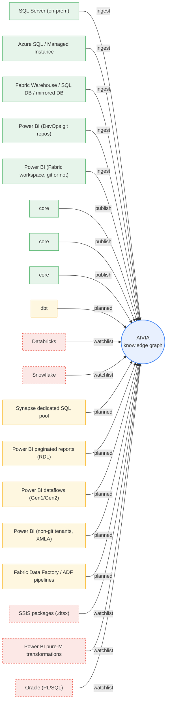

<!-- GENERATED FILE — do not edit.
     Source: INTEGRATION_REGISTRY in src/integration_registry.py
     Regenerate: python scripts/generate_docs.py
     CI fails if this file differs from regeneration. -->

<!-- TIER: BLUEPRINT — component key: integration
     src/trace_registry.py ARCHITECTURE_COMPONENTS -->

# Integration Map

The tool/connector landscape as data: what we parse on the way in
(always via each layer's native parser, ADR 0001) and what we publish
on the way out. Supersedes the ROADMAP connector table (2026-08-07),
the REFERENCE_ARCHITECTURE tier table, and — since ADR 0069 —
SOURCE_CONNECTORS.md, whose configurations became rows here and whose
standing doctrine follows below.

| From | To | Artifact parsed | Mechanism | Status | Tier | Direction |
|---|---|---|---|---|---|---|
| SQL Server (on-prem) | core | sys.sql_modules definitions (procs + views) | extractor: onprem_gateway profile (JDBC via On-premises Data Gateway) -> ScriptDom | shipped | Basic | ingest |
| Azure SQL / Managed Instance | core | sys.sql_modules definitions (procs + views) | extractor: azure_direct profile (AAD-token pyodbc) -> ScriptDom | shipped | Basic | ingest |
| Fabric Warehouse / SQL DB / mirrored DB | core | sys.sql_modules definitions (procs + views) | extractor: fabric_native profile (AAD-token pyodbc) -> ScriptDom | shipped | Basic | ingest |
| Power BI (DevOps git repos) | core | TMDL (.SemanticModel: partitions, DAX measures, calc columns) | TMDL parser via devops_git profile (PAT from Key Vault) | shipped | Pro | ingest |
| Power BI (Fabric workspace, git or not) | core | TMDL incl. DirectLake partitions (entityName) | TMDL parser via workspace profile (REST getDefinition, no git needed) or folder profile (git-synced); DirectLake = pattern 5, report->technical edges | shipped | Pro | ingest |
| core | Power BI reports | report descriptions (Fabric REST PATCH) | fabric_pbi adapter, lineage-exact matching (920_publish_pbi) | shipped | Pro | publish |
| core | Collibra | assets + descriptions + glossary terms (REST) | collibra adapter (900_publish_collibra) | shipped | Pro | publish |
| core | Microsoft Purview | assets + descriptions (REST) | purview adapter (910_publish_purview) | shipped | Pro | publish |
| dbt | core | manifest.json (DAG from ref() edges) + compiled T-SQL | manifest reader (native JSON) -> ScriptDom on compiled SQL | planned | Pro | ingest |
| Databricks | core | SQL views + Unity Catalog DDL ONLY (PySpark/DLT notebook logic out of scope) | PARSER TBD at build time: Spark Catalyst in-runtime vs documented doctrine exception | watchlist | Pro | ingest |
| Snowflake | core | GET_DDL() over views / materialized views / tasks / dynamic tables | native parser per ADR 0001 (ANTLR grammar); sqlglot is banned repo-wide (spec:G2) | watchlist | Pro | ingest |
| Synapse dedicated SQL pool | core | procs + views (sys.sql_modules, legacy estates) | same T-SQL catalog as Azure SQL -> ScriptDom | planned | Basic | ingest |
| Power BI paginated reports (RDL) | core | dataset CommandText = raw SQL inside report XML | XML walk -> ScriptDom | planned | Basic | ingest |
| Power BI dataflows (Gen1/Gen2) | core | M documents (model.json / definition API), often with native queries | fetch document -> native-query extraction -> ScriptDom | planned | Basic | ingest |
| Power BI (non-git tenants, XMLA) | core | same TMDL content as the git route | XMLA read-only endpoint export instead of DevOps git | planned | Basic | ingest |
| Fabric Data Factory / ADF pipelines | core | SQL inside Script / Stored-Proc-call / Copy activities (pipeline JSON) | definitions via git or REST -> walk activities -> ScriptDom | planned | Basic | ingest |
| SSIS packages (.dtsx) | core | SQL in Execute-SQL tasks and sources (XML) | XML walk -> ScriptDom | watchlist | Basic | ingest |
| Power BI pure-M transformations | core | folding/merging logic written in M itself (no SQL string) | needs the M dialect tier beyond the ADR 0041 mini-parser | watchlist | Basic | ingest |
| Oracle (PL/SQL) | core | packages / procedures / views | native parser per ADR 0001 (ANTLR PL/SQL grammar) | watchlist | Basic | ingest |

## Notes

- **SQL Server (on-prem) → core**: 1.8.0 — turn-key front door; definitions stored as extracted
- **Azure SQL / Managed Instance → core**: 1.8.0
- **Fabric Warehouse / SQL DB / mirrored DB → core**: 1.8.0
- **Power BI (DevOps git repos) → core**: 1.9.0 — consumption layer (ADR 0040); v1 scope per Sunny 2026-08-16
- **Power BI (Fabric workspace, git or not) → core**: workspace profile 1.11.0 — verify Fabric-WH-endpoint M shapes with a real fixture
- **core → Power BI reports**: 1.9.0 — pushes logged to gov_publish_log
- **dbt → core**: NEXT — cheapest connector; out of v1 unless a design partner needs it
- **Databricks → core**: post-v1; 2026-08-07 parser note updated 2026-09-02: ADR 0001 total, ANTLR grammar when built
- **Snowflake → core**: post-v1; same stale-parser caveat as Databricks — record decision here when made
- **Synapse dedicated SQL pool → core**: ex-SOURCE_CONNECTORS A7 (P3); legacy healthcare estates
- **Power BI paginated reports (RDL) → core**: ex-SOURCE_CONNECTORS B5 (P3); trivial walk, legacy-heavy verticals
- **Power BI dataflows (Gen1/Gen2) → core**: ex-SOURCE_CONNECTORS B4 (P3); verify definition API shape before build
- **Power BI (non-git tenants, XMLA) → core**: ex-SOURCE_CONNECTORS B6 (P3); verify export format before build
- **Fabric Data Factory / ADF pipelines → core**: ex-SOURCE_CONNECTORS C1 (P3)
- **SSIS packages (.dtsx) → core**: ex-SOURCE_CONNECTORS C2 (P4); legacy-heavy verticals only
- **Power BI pure-M transformations → core**: ex-SOURCE_CONNECTORS B2 (P4); until built these partitions are counted as known-unparsed in ops tracking — disclosed, never silent
- **Oracle (PL/SQL) → core**: ex-SOURCE_CONNECTORS part D; dialect tier + connector when demanded

## Change monitoring (shipped mechanism, three triggers)

ETL and CI/CD are just TRIGGERS; the core is one mechanism we own:
re-collect + content-hash diff (ADR 0022, `src/extractor/tracker.py`)
— per object, deterministic, source-agnostic.

- **scheduled_sweep** (the universal floor): nightly/weekly pipeline re-collects (modify_date prefilters), diffs hashes, re-parses only changed objects; works for every connector incl. file drop, no customer CI required
- **cicd_hook** (the fast path where git exists): a pipeline step on merge calls the same collect+diff; instant freshness for DevOps-managed sources; never required
- **etl_posthook** (the third doorway): shops whose procs deploy via ETL call the same entry as a final step; same mechanism

**The governance payoff:** certification pins a version (ADR 0022), so a drifted object flips its dependents to 'definition changed since certification' — disclosed in every answer (ADR 0021), a DriftEvent lands, the steward gets a diff. The certification lifecycle closing its loop.

## Object identity across re-ingests

identity is the fully qualified name DECLARED IN THE SQL (schema.object, case-folded per ADR 0016) — never the file name; metric_id (ADR 0015) is that name; the content hash (ADR 0022) is its version. Same name + new hash = drift (the normal case).

**The rename ladder** (each step typed per spec:E3 — computable steps
are code's, judgment steps are the steward's, never auto-merged):

1. **exact_hash_rename** (computable): a new name whose content hash equals a vanished name's hash auto-maps, disclosed as 'renamed from X'
2. **step_overlap_similarity** (judgment): per-step fragment hashes score candidate rename+edits; the system PROPOSES with evidence, the steward CONFIRMS; confirmed mappings land as append-only alias records carrying history
3. **no_match** (computable): genuinely new object; the vanished one is archived

| Source | Stable id? | Use |
|---|---|---|
| SQL Server / Azure SQL object_id | NO | DROP+CREATE deployments mint new ones — declared name only |
| file drop paths | NO | customers reorganize folders — declared name only |
| Power BI artifacts | yes | stable GUIDs are the identity |
| DevOps git sources | partial | partial — git rename detection feeds ladder step 1 |
| dbt | yes | unique_id is the identity |

**Shipping decision (Sunny, 2026-08-11):** v1 ships the limitation, loudly
— renames reset governance history; the install guide warns admins.
Ladder steps 1–2 are built only if rename-loss blocks more than a
one-off customer.
