<!-- GENERATED FILE — do not edit.
     Source: TABLE_REGISTRY in src/schemas.py
     Regenerate: python scripts/generate_docs.py
     CI fails if this file differs from regeneration. -->

# Pipeline Dataflow Map

Every edge below is a declared, code-verified fact from the data contracts:
solid arrows into a table are its owner/enricher writes, dashed arrows are
sanctioned utility writers, and arrows out of a table are its declared
consumers (notebook reads are verified against code by the contract tests).

```mermaid
flowchart LR
  01_install["01_install"]:::notebook
  02_parse["02_parse"]:::notebook
  03_build_graph["03_build_graph"]:::notebook
  04_build_metric_logic["04_build_metric_logic"]:::notebook
  05_export_graph_tables["05_export_graph_tables"]:::notebook
  06_validate["06_validate"]:::notebook
  07_generate_descriptions["07_generate_descriptions"]:::notebook
  08_publish_collibra["08_publish_collibra"]:::notebook
  09_publish_purview["09_publish_purview"]:::notebook
  10_ingest_agent_events["10_ingest_agent_events"]:::notebook
  11_refresh_search_index["11_refresh_search_index"]:::notebook
  12_ingest_semantic_models["12_ingest_semantic_models"]:::notebook
  13_publish_pbi["13_publish_pbi"]:::notebook
  collibra_lineage_match["collibra_lineage_match"]:::notebook
  eventhouse_semantic_search["eventhouse_semantic_search"]:::notebook
  export_test_fixtures["export_test_fixtures"]:::notebook
  extract_views["extract_views"]:::notebook
  health["health"]:::notebook
  load_caboodle_dictionary["load_caboodle_dictionary"]:::notebook
  load_clarity_dictionary["load_clarity_dictionary"]:::notebook
  load_sql_files["load_sql_files"]:::notebook
  manage_stewards["manage_stewards"]:::notebook
  orchestrator_core["orchestrator_core"]:::notebook
  usage["usage"]:::notebook
  verify_graph["verify_graph"]:::notebook
  LPG_export__14_typed_tables_[("LPG export (14 typed tables)")]:::table
  gov_feedback_events[("gov_feedback_events")]:::table
  gov_publish_log[("gov_publish_log")]:::table
  gov_steward_assignments[("gov_steward_assignments")]:::table
  gov_turn_events[("gov_turn_events")]:::table
  graph_edges[("graph_edges")]:::table
  graph_nodes[("graph_nodes")]:::table
  input_dax_expressions[("input_dax_expressions")]:::table
  input_dict_columns[("input_dict_columns")]:::table
  input_dict_tables[("input_dict_tables")]:::table
  input_metric_names[("input_metric_names")]:::table
  input_report_sources[("input_report_sources")]:::table
  input_sql_sources[("input_sql_sources")]:::table
  ops_agent_descriptions[("ops_agent_descriptions")]:::table
  ops_build_summary[("ops_build_summary")]:::table
  ops_description_cache[("ops_description_cache")]:::table
  ops_error_log[("ops_error_log")]:::table
  ops_extraction_tracking[("ops_extraction_tracking")]:::table
  ops_installation_errors[("ops_installation_errors")]:::table
  ops_parse_errors[("ops_parse_errors")]:::table
  ops_parse_results[("ops_parse_results")]:::table
  ops_parse_successes[("ops_parse_successes")]:::table
  ops_phi_findings[("ops_phi_findings")]:::table
  ops_pipeline_validation[("ops_pipeline_validation")]:::table
  ops_setup_completeness[("ops_setup_completeness")]:::table
  output_metric_logic[("output_metric_logic")]:::table
  output_semantic_catalog[("output_semantic_catalog")]:::table
  admin{{admin}}:::actor
  collibra_adapter{{collibra_adapter}}:::actor
  data_agent{{data_agent}}:::actor
  01_install --> input_dict_columns
  01_install --> input_dict_tables
  01_install --> input_sql_sources
  01_install --> ops_installation_errors
  02_parse --> ops_error_log
  02_parse --> ops_parse_errors
  02_parse --> ops_parse_results
  02_parse --> ops_parse_successes
  02_parse --> ops_phi_findings
  03_build_graph --> graph_edges
  03_build_graph --> graph_nodes
  03_build_graph --> ops_setup_completeness
  04_build_metric_logic --> output_metric_logic
  05_export_graph_tables --> LPG_export__14_typed_tables_
  06_validate --> ops_build_summary
  06_validate --> ops_pipeline_validation
  07_generate_descriptions --> ops_description_cache
  07_generate_descriptions -->|enrich| graph_nodes
  07_generate_descriptions -->|enrich| output_metric_logic
  08_publish_collibra --> gov_publish_log
  08_publish_collibra --> ops_agent_descriptions
  09_publish_purview -->|enrich| gov_publish_log
  10_ingest_agent_events --> gov_feedback_events
  10_ingest_agent_events --> gov_turn_events
  11_refresh_search_index --> output_semantic_catalog
  12_ingest_semantic_models --> input_dax_expressions
  12_ingest_semantic_models --> input_metric_names
  12_ingest_semantic_models --> input_report_sources
  13_publish_pbi -->|enrich| gov_publish_log
  extract_views --> ops_extraction_tracking
  extract_views -.-> input_sql_sources
  gov_feedback_events --> 10_ingest_agent_events
  gov_feedback_events --> admin
  gov_feedback_events --> usage
  gov_publish_log --> admin
  gov_steward_assignments --> 03_build_graph
  gov_steward_assignments --> manage_stewards
  gov_turn_events --> 10_ingest_agent_events
  gov_turn_events --> admin
  gov_turn_events --> usage
  graph_edges --> 04_build_metric_logic
  graph_edges --> 05_export_graph_tables
  graph_edges --> 06_validate
  graph_edges --> 07_generate_descriptions
  graph_edges --> 08_publish_collibra
  graph_edges --> 13_publish_pbi
  graph_edges --> data_agent
  graph_edges --> verify_graph
  graph_nodes --> 04_build_metric_logic
  graph_nodes --> 05_export_graph_tables
  graph_nodes --> 06_validate
  graph_nodes --> 07_generate_descriptions
  graph_nodes --> 08_publish_collibra
  graph_nodes --> 11_refresh_search_index
  graph_nodes --> 13_publish_pbi
  graph_nodes --> data_agent
  graph_nodes --> manage_stewards
  graph_nodes --> verify_graph
  input_dax_expressions --> 03_build_graph
  input_dict_columns --> 01_install
  input_dict_columns --> 03_build_graph
  input_dict_columns --> export_test_fixtures
  input_dict_columns --> load_caboodle_dictionary
  input_dict_tables --> 01_install
  input_dict_tables --> 03_build_graph
  input_dict_tables --> 06_validate
  input_dict_tables --> export_test_fixtures
  input_dict_tables --> load_caboodle_dictionary
  input_metric_names --> 03_build_graph
  input_metric_names --> collibra_lineage_match
  input_report_sources --> 03_build_graph
  input_sql_sources --> 01_install
  input_sql_sources --> 02_parse
  input_sql_sources --> 06_validate
  load_caboodle_dictionary -.-> input_dict_columns
  load_caboodle_dictionary -.-> input_dict_tables
  load_clarity_dictionary -.-> input_dict_columns
  load_clarity_dictionary -.-> input_dict_tables
  load_sql_files -.-> input_sql_sources
  manage_stewards --> gov_steward_assignments
  ops_agent_descriptions --> 08_publish_collibra
  ops_agent_descriptions --> collibra_adapter
  ops_build_summary --> admin
  ops_description_cache --> 07_generate_descriptions
  ops_error_log --> 02_parse
  ops_error_log --> admin
  ops_extraction_tracking --> extract_views
  ops_installation_errors --> data_agent
  ops_parse_errors --> 06_validate
  ops_parse_errors --> data_agent
  ops_parse_errors --> verify_graph
  ops_parse_results --> 03_build_graph
  ops_parse_results --> export_test_fixtures
  ops_parse_successes --> 02_parse
  ops_parse_successes --> 06_validate
  ops_parse_successes --> verify_graph
  ops_phi_findings --> 02_parse
  ops_phi_findings --> 07_generate_descriptions
  ops_pipeline_validation --> admin
  ops_pipeline_validation --> data_agent
  ops_setup_completeness --> admin
  ops_setup_completeness --> health
  output_metric_logic --> 07_generate_descriptions
  output_metric_logic --> 08_publish_collibra
  output_metric_logic --> 09_publish_purview
  output_metric_logic --> data_agent
  output_semantic_catalog --> data_agent
  output_semantic_catalog --> eventhouse_semantic_search
  output_semantic_catalog --> orchestrator_core
  classDef notebook fill:#e8f0fe,stroke:#4285f4
  classDef table fill:#fef7e0,stroke:#f9ab00
  classDef actor fill:#e6f4ea,stroke:#34a853
```

Planned tables (contracts without writers) and per-table details — columns,
invariants, relations — live in `src/schemas.py`.
