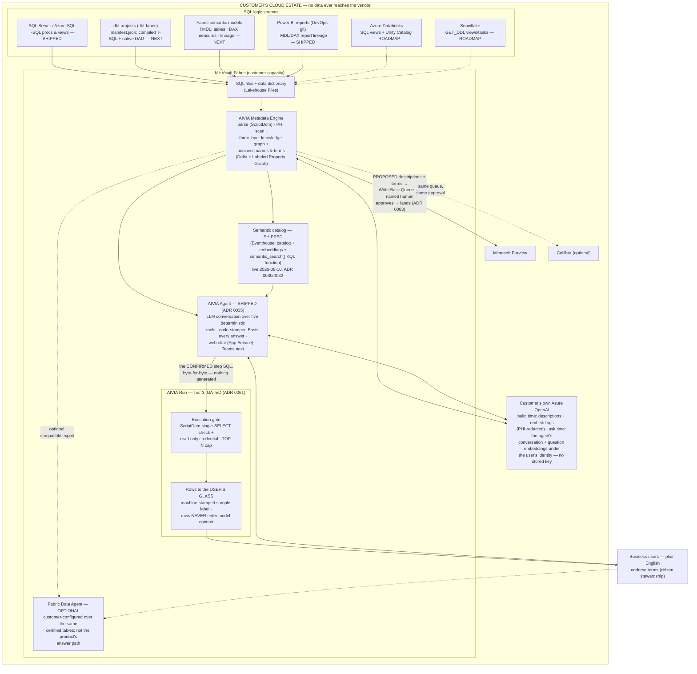

# AIVIA Reference Architecture

<!-- TIER: BLUEPRINT — generated marker, do not remove.
     Component key: reference (src/trace_registry.py ARCHITECTURE_COMPONENTS)
     Enforced by tests/test_trace_registry.py hierarchy checks. -->

> **Blueprint tier.** This file satisfies axiom groups **axm:S**
> (Specification) · **axm:B** (Boundary) from
> [AI_VIA_AXIOMS.md](../AI_VIA_AXIOMS.md), and is the architecture home
> for 6 decisions
> (see [TRACE_MAP.md](TRACE_MAP.md#the-blueprint-tier) for the full
> chain: decision → component → axioms → code → tests).

**Audience:** Marketplace listing, Microsoft certification reviewers, and
co-sell bill of materials. The security-focused companion view lives in
[ARCHITECTURE.md](ARCHITECTURE.md) ("System at a Glance"); this document
is the product view: both tiers, all source connectors, and the Azure
consumption footprint. This mermaid is the source of truth — regenerate
designed/PDF versions from it, never the reverse. Current designed
export: `docs/product/AIVIA Architecture Diagram V2.0.pdf`.

## Source connector tiers

| Source | What's extracted | Dialect / parser | Status |
|---|---|---|---|
| SQL Server / Azure SQL | Stored procs, views (live extraction or file drop) | T-SQL / ScriptDom | **Shipped** |
| Power BI reports (DevOps git) | TMDL + DAX report lineage | TMDL (structured text) | **Shipped** |
| dbt (dbt-fabric) | `manifest.json`: compiled SQL, model DAG, docs, tests | Compiled T-SQL / ScriptDom (DAG comes free from `ref()` edges) | Next — cheapest connector; manifest is JSON, no Jinja parsing |
| Fabric semantic models | TMDL: tables, partitions, relationships, DAX measures | TMDL now; DAX measure parsing is its own lane (ADR 0001) | Next — lineage first, DAX semantics later |
| Azure Databricks | SQL views + Unity Catalog DDL (**scope: SQL only** — PySpark/DLT notebook logic is a separate future problem) | Spark SQL — native parser per ADR 0001 (ANTLR grammar); parser TBD at build time | Roadmap |
| Snowflake | `GET_DDL()`: views, materialized views, tasks, dynamic tables | Snowflake SQL — native parser per ADR 0001 (ANTLR grammar); parser TBD at build time | Roadmap |

> **Parser note (ADR 0001, amended total 2026-08-19).** Earlier drafts
> named a "sqlglot dialect" for these two rows. sqlglot/sqlparse are
> deleted repo-wide and CI-banned (`spec:G2`), so no roadmap connector
> may adopt them: each new dialect gets its own native parser. Both
> rows are also recorded as explicit `spec:C1` exclusions for the
> Fabric-native v1 — the exclusion rows exist so the roadmap pressure
> stays visible rather than becoming a silent gap.

**2026-08-08 additions:** business names + report links flow inside the
Metadata Engine (no topology change); the **Purview arrow now carries
glossary terms** at term grain, one term per definition, multi-asset
assigned (ADR 0031); the **semantic catalog** node is settled — engine
DECIDED by live probes 2026-08-08 (SQL-DB path failed at the agent's
validation layer; **Eventhouse PASSED end to end**, ADR 0030) — still
roadmap-yellow because the product pipeline that fills it isn't built.
When it ships, the Azure OpenAI arrow gains an **ask-time** leg
(question-phrase embeddings, user impersonation, no stored key) — a
security-story change the whitepaper must state explicitly: user
question text, not SQL fragments, reaches the customer's own endpoint
at ask time. Topology is now settled — the Lucid/designed PDF should be
updated to match on its next pass (add the Eventhouse semantic-catalog
box, roadmap style).

## What runs, per tier (the architecture view)

> **The offer lives elsewhere.** Tier definitions, packaging,
> sequencing, pricing, and positioning are product decisions and belong
> to [../product/PRODUCT_TIERS.md](../product/PRODUCT_TIERS.md) (ADR
> 0063, the tier lock). This section covers only what the *system* does
> in each tier. The two-tier "Metadata Engine / Analytics Self-Service"
> split this document once described is superseded.

| Tier | What the system runs |
|---|---|
| **X-Ray** | The full pipeline once, in the customer's tenant: harvest → parse → graph → the ADR 0054 sweep → report generation. Nothing persists that the customer doesn't keep; the engine is removable. |
| **Bridge** | The same pipeline, continuous, plus the write path: proposal generation into the review queue, then file export (stage 1) or catalog API (stage 2). Headless — no end-user surface to serve. |
| **Workbench** | The dialogue-loop engine (ADR 0062) driven by predefined verbs rather than open questions: grounding, compare, evidence cards, the graph panel, all behind buttons. |
| **Run** | The ADR 0061 execution path: ScriptDom single-SELECT gate, read-only credential, TOP-N cap, rows to glass and never into model context (`spec:R6`–`R8`). **Not GA** — gated on the output-side PHI gate. |

Architecturally these are one engine with different surfaces attached,
which is why Bridge is shippable without any UI and why Run adds an
execution leg rather than a second system.

## Azure consumption footprint (co-sell annotation)

Field-seller-relevant consumption this solution drives, in order:
**Fabric capacity** (pipeline + Eventhouse + graph), **Azure
OpenAI** (customer's own endpoint, build-time), **Microsoft Purview**
(catalog publish), **Azure DevOps** (git-integrated workspaces, TMDL
lineage), **Azure SQL / SQL Server** (source estates). Snowflake and
Databricks connectors pull external SQL estates *into* Fabric governance
— workload gravity toward Microsoft, not away.

## Review-critical properties (certification / attestation)

1. Everything runs in the customer's tenant on customer capacity; the
   vendor ships a library (.whl) and holds no data, no keys, no service.
2. The only AI dependency is the **customer's own Azure OpenAI**
   endpoint; fragments are PHI-redacted (deterministic rules, ADR 0025)
   before any prompt is built; interactive answers never call out.
3. Agent answers are grounded exclusively in the certified graph, with
   certification state and named owners disclosed (ADR 0021) — refusal
   over fabrication (ADR 0005).
