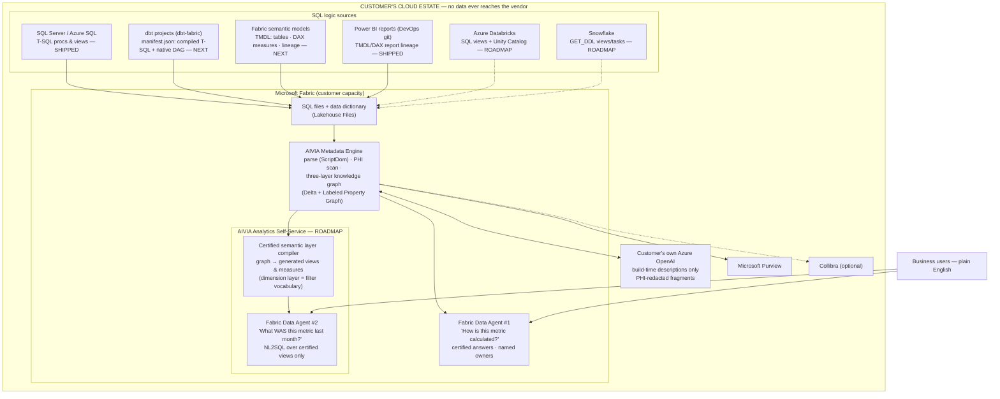

# AIVIA Reference Architecture

**Audience:** Marketplace listing, Microsoft certification reviewers, and
co-sell bill of materials. The security-focused companion view lives in
[ARCHITECTURE.md](ARCHITECTURE.md) ("System at a Glance"); this document
is the product view: both tiers, all source connectors, and the Azure
consumption footprint. This mermaid is the source of truth — regenerate
designed/PDF versions from it, never the reverse.

## Source connector tiers

| Source | What's extracted | Dialect / parser | Status |
|---|---|---|---|
| SQL Server / Azure SQL | Stored procs, views (live extraction or file drop) | T-SQL / ScriptDom | **Shipped** |
| Power BI reports (DevOps git) | TMDL + DAX report lineage | TMDL (structured text) | **Shipped** |
| dbt (dbt-fabric) | `manifest.json`: compiled SQL, model DAG, docs, tests | Compiled T-SQL / ScriptDom (DAG comes free from `ref()` edges) | Next — cheapest connector; manifest is JSON, no Jinja parsing |
| Fabric semantic models | TMDL: tables, partitions, relationships, DAX measures | TMDL now; DAX measure parsing is its own lane (ADR 0001) | Next — lineage first, DAX semantics later |
| Azure Databricks | SQL views + Unity Catalog DDL (**scope: SQL only** — PySpark/DLT notebook logic is a separate future problem) | Spark SQL / sqlglot dialect | Roadmap |
| Snowflake | `GET_DDL()`: views, materialized views, tasks, dynamic tables | Snowflake SQL / sqlglot dialect | Roadmap |

## The two tiers, one sentence each

- **Metadata Engine (shipped):** parses the SQL estate into a certified,
  steward-owned knowledge graph and answers *"how is this calculated?"*
  with named accountability — refusing beyond the graph (ADR 0005/0021).
- **Analytics Self-Service (roadmap):** a build-time **compiler**, not a
  new runtime — it emits each certified metric's assembled SQL (ADR 0003
  fragments) as generated views/measures, parameterized by the dimension
  layer (ADR 0029); Data Agent #2 runs plain NL2SQL over those views, so
  the generator's habitual query IS the certified query (the ADR 0020
  lesson applied to execution). Runtime is 100% Microsoft's engine.

## Azure consumption footprint (co-sell annotation)

Field-seller-relevant consumption this solution drives, in order:
**Fabric capacity** (pipeline + both Data Agents + graph), **Azure
OpenAI** (customer's own endpoint, build-time), **Microsoft Purview**
(catalog publish), **Azure DevOps** (git-integrated workspaces, TMDL
lineage), **Azure SQL / SQL Server** (source estates). Snowflake and
Databricks connectors pull external SQL estates *into* Fabric governance
— workload gravity toward Microsoft, not away.

## Review-critical properties (certification / attestation)

1. Everything runs in the customer's tenant on customer capacity; the
   vendor ships a library (.whl) and holds no data, no keys, no service.
2. The only AI dependency is the **customer's own Azure OpenAI**
   endpoint; fragments are PHI-redacted (deterministic rules, ADR 0025)
   before any prompt is built; interactive answers never call out.
3. Agent answers are grounded exclusively in the certified graph, with
   certification state and named owners disclosed (ADR 0021) — refusal
   over fabrication (ADR 0005).
