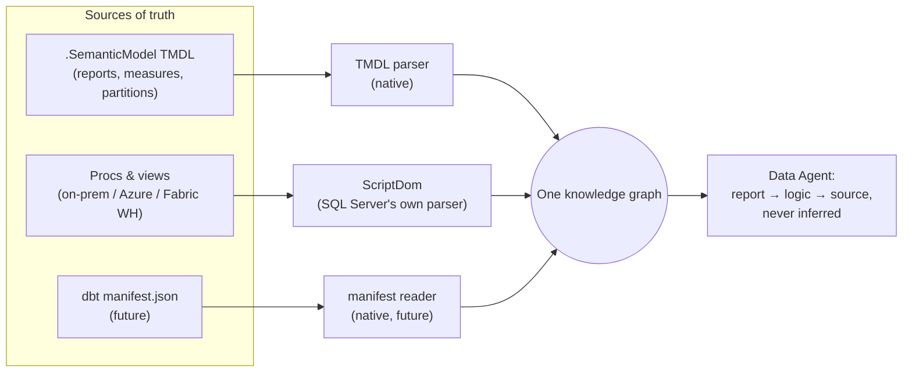

# Handoff — PBI / semantic-model layer: from prototype constellation to product

> **Status (2026-08-16, dev session): items 1–5 implemented in 1.9.0.**
> ADR 0040 (consumption layer; ghost dimension layer REMOVED). Notebook
> 12_ingest_semantic_models writes the three input tables
> (input_metric_names planned→active); 03 builds report/measure nodes;
> 05 exports them. Source profiles: folder (Fabric-native, no
> credentials) + devops_git (PAT from Key Vault at run time — hardcoded
> TODO gone). fabric_pbi verdict: WIRED as 13_publish_pbi with
> lineage-exact matching (name-similarity guesser deleted); pushes log
> to gov_publish_log. E2E TMDL-fixture tests in
> tests/steps/test_semantic_models.py. Scoping decision (below) is
> reflected in ADR 0040: PBI layer IS v1. Appendix source-shape matrix:
> DirectLake pattern 5 IMPLEMENTED same-day (parser + report→technical
> edge + graph_edge_report2technical export); Fabric-WH-endpoint shapes
> ride patterns 1–4 (verify with a real fixture on Fabric); dbt manifest
> parser stays future.
> Fabric upgrade note: DROP TABLE graph_dimension, graph_edge_tech2dim;
> re-map the Graph Model to the new export tables (05 docstring).

**From:** learning/review session, 2026-08-16. **To:** dev session.
**Origin:** Sunny's turn-key review — "PBI calls these procs, adds formulas
and visuals; in the cloud there will be semantic models. We did some work,
never tested. Turn-key or hodge-podge?" Answer: hodge-podge with one
library-grade core.

## Inventory (verified 2026-08-16)

- src/extractor/devops_tmdl.py — TMDL parser: partition M-expressions
  (deterministic report→proc/view lineage), DAX measures, calc columns.
  13 tests, byte-exact fixtures. LIBRARY-GRADE. The asset.
- notebooks/utilities/devops_lineage.py — manual driver; PAT="" TODO;
  prints summaries; writes NOTHING to pipeline tables.
- src/adapters/fabric_pbi.py — description write-back onto PBI reports via
  Fabric REST. 246 lines, ZERO callers (audit ghost list). Wire or delete.
- collibra_lineage_match + notebook 08 — _PBI-suffix metric ↔ Collibra
  report asset matching. LIVE, 21 tests, but Collibra-specific.
- input_metric_names — registry status "planned"; 03 reads it optionally;
  nothing has ever written it. The intended landing spot for report names.

Nothing above is wired into the numbered pipeline; never run end-to-end.

## Architectural framing (agreed with Sunny)

Business logic splits across TWO layers in every environment: SQL
(procs/views — on-prem heavy) and DAX (measures/calc columns —
Fabric-native heavy). Both native parsers already exist (ScriptDom, TMDL
parser). What is missing is a HOME: the graph has no report/measure node
types, so the DAX half is extracted and discarded.

## Wanted

1. **ADR: graph model extension** — report + measure node types; edges
   report→canonical (partition lineage), measure→columns (DAX refs);
   exports + agent instructions follow. Same scale of decision as
   graph-vs-delta; do NOT bolt on without the ADR. Consider whether the
   ghost DIMENSION layer's removal/repurposing folds into the same ADR.
2. **Semantic-model source profiles** (mirror of extractor handoff item 6):
   (a) DevOps git repo w/ PAT (today — PAT must move to Key Vault, not the
   hardcoded TODO); (b) Fabric-native: semantic-model definitions read from
   workspace items / git-synced .SemanticModel folders — no DevOps
   dependency.
3. **Activate input_metric_names**: a numbered (or 00-family) notebook that
   runs the TMDL extraction and writes the table 03 already knows how to
   consume; registry status planned→active; precondition/optional-input
   wiring follows automatically from the contracts.
4. **fabric_pbi.py verdict**: wire it (description write-back = the
   enrichment-out story, "answer is a caption" applied to PBI) or delete it
   per the ghost rule. Zero-caller code may not keep existing by default.
5. **End-to-end test** with recorded TMDL fixtures through whatever
   pipeline shape 1–3 produce.

## Follow-ups (2026-08-16, post-1.9.0)

> **Status (2026-08-16, dev session): all three implemented in 1.9.2.**
> (1) extract_pbix_sources.py DELETED; its live-tested
> friendly_name_from_report moved to src/governance/display_names (now
> used by the TMDL path); reading its multi-report handling exposed and
> fixed a real 1.9.0 bug — two reports EXECing the same proc would have
> emitted duplicate metric_id rows and failed 12's unique-invariant
> gate. (2) collibra_lineage_match docstring corrected (publishing-side
> ASSET MATCHING, not lineage) AND the upgrade implemented: exact
> TMDL-derived names from input_metric_names match deterministically
> (score 1.0, no fuzzy fallback when the exact name is known); _PBI
> heuristic demoted to fallback. (3) The scoping header had already been
> reconciled same-day in 1.9.0.

Verdicts from the failed-lineage-attempts review (Sunny asked; recorded
late — the review session initially promised these only in conversation):

1. **DELETE scripts/extract_pbix_sources.py** — pbix-cracking is superseded
   in every path: git-integrated workspaces serialize TMDL, and
   non-integrated ones yield TMDL via the Fabric getDefinition REST API.
   Zero callers (audit ghost list). No scenario keeps it alive.
2. **Correct collibra_lineage_match's story** — it survived by changing
   jobs: it is publishing-side ASSET MATCHING (find the Collibra asset to
   write a description onto), not lineage. Docstring still introduces it
   as report-matching-by-naming-convention lineage. Update docstring (and
   consider keying on exact TMDL-derived report names now that
   input_metric_names is active, shrinking the _PBI-suffix heuristic).
3. Minor: the 1.9.0 status header above says the scoping question "stays
   open" — it does not; see DECIDED section below. Reconcile the header.

## Scoping — DECIDED (Sunny, 2026-08-16): PBI layer IS v1 Marketplace scope

Rationale: real customers ask about REPORTS, not procs/views — the report
layer is the customer-facing entry point, so items 1–5 precede launch
hardening. Development happened bottom-up (SQL first); the customer
experience is top-down.

## Appendix: source-shape matrix for the TMDL parser (2026-08-16)

The METHOD (parse the model's git-serialized definition) covers every
case; the current four M-expression patterns do not:

| Model type | Partition shape | Parser today |
|---|---|---|
| Import/DirectQuery → on-prem SQL | Odbc.DataSource nav, Odbc.Query exec, Sql.Database [Query=EXEC], Sql.Databases nav | COVERED (patterns 1–4) |
| Import/DirectQuery → Fabric Warehouse SQL endpoint | same shapes, endpoint hostname (*.datawarehouse.fabric.microsoft.com) | likely covered — verify with a real fixture |
| DirectLake (Fabric-native default) | mode: directLake, entityName = warehouse/lakehouse TABLE, expression source; NO Query/EXEC (DirectLake cannot call procs; views fall back to DirectQuery) | MISSING — needs pattern 5 |
| dbt-built objects under any of the above | TMDL sees only the terminal object; dbt's internal DAG lives in manifest.json (deterministic; compiled SQL is T-SQL → ScriptDom-parseable) | future third parser — out of v1 unless a design partner needs it |

DirectLake implication for the graph model: report→table→materializing
proc is a TWO-hop chain crossing artifacts (TMDL + extracted SQL); the
graph design in item 1 must allow the report layer to attach to technical
tables, not only to canonical procs.

## Pitch line (Sunny-approved, added to website 2026-08-16)

"A federation of native parsers, one per layer, stitched into one graph."
Also on Sunny's list: a DIAGRAM visualizing the federation (layers:
PBI/TMDL → SQL/ScriptDom → [future dbt/manifest], each parser feeding one
graph). Draft mermaid to iterate from:

